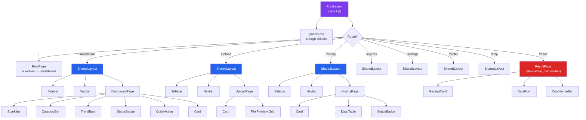
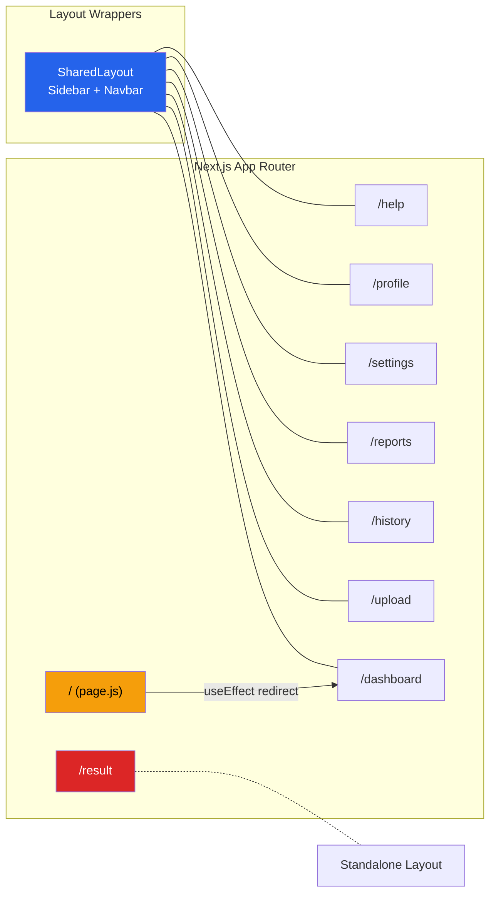
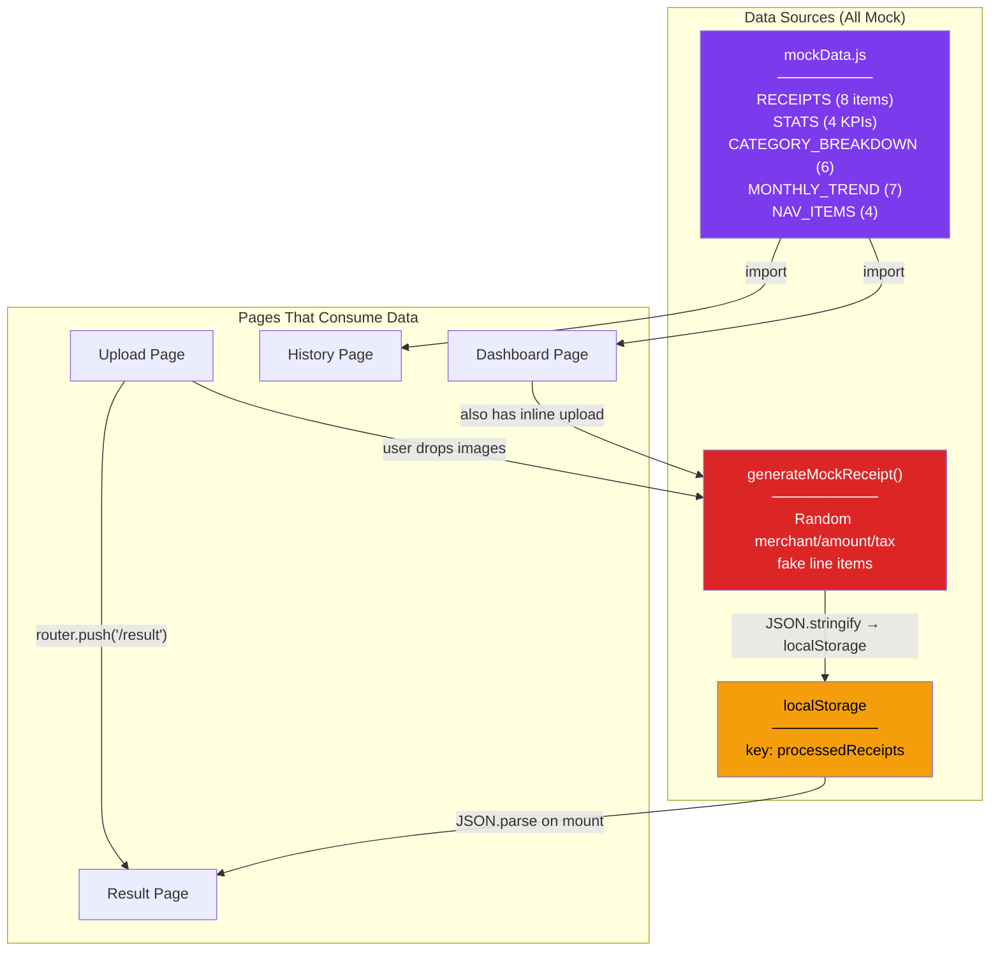
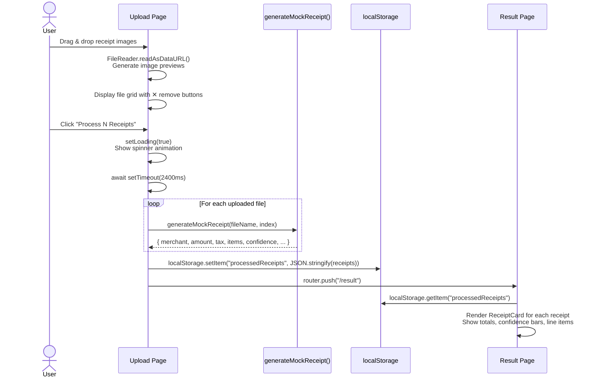
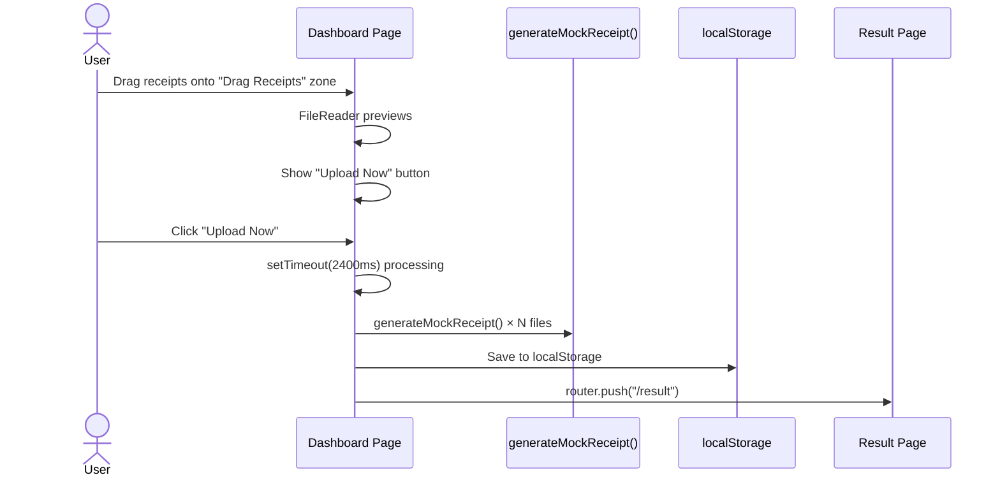
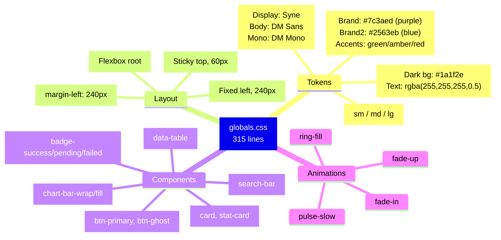
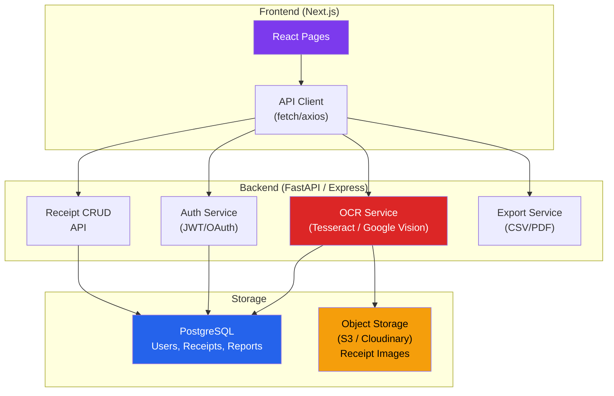

# FinSight — Full Architecture Walkthrough

## 1. Project Overview

**FinSight** is a frontend-only prototype for an AI-powered receipt/invoice scanner and expense management system. It's built with **Next.js 16 (App Router)** and uses **mock data** — no real backend or OCR exists yet.

---

## 2. File Structure

```
invoice_detection/
├── frontend/
│   ├── src/
│   │   └── app/
│   │       ├── layout.js              ← Root layout (html + body + globals.css)
│   │       ├── page.js                ← "/" → auto-redirects to /dashboard
│   │       ├── globals.css            ← Design system (315 lines of CSS tokens + components)
│   │       │
│   │       ├── components/
│   │       │   ├── SharedLayout.jsx   ← Wraps Sidebar + Navbar + {children}
│   │       │   ├── Sidebar.jsx        ← Dark sidebar navigation (fixed left)
│   │       │   ├── Navbar.jsx         ← Top navbar (search, notifications, user)
│   │       │   ├── Card.jsx           ← Reusable card wrapper
│   │       │   └── Button.jsx         ← Button component
│   │       │
│   │       ├── lib/
│   │       │   └── mockData.js        ← All fake data (receipts, stats, categories, nav)
│   │       │
│   │       ├── dashboard/
│   │       │   ├── layout.js          ← SharedLayout wrapper
│   │       │   └── page.js            ← Main dashboard (624 lines)
│   │       │
│   │       ├── upload/
│   │       │   ├── layout.js          ← SharedLayout wrapper
│   │       │   └── page.js            ← Receipt upload page (563 lines)
│   │       │
│   │       ├── result/
│   │       │   └── page.js            ← OCR result display (448 lines, standalone layout)
│   │       │
│   │       ├── history/
│   │       │   ├── layout.js          ← SharedLayout wrapper
│   │       │   └── page.js            ← Receipt history table
│   │       │
│   │       ├── reports/
│   │       │   ├── layout.js          ← SharedLayout wrapper
│   │       │   └── page.js            ← Reports page
│   │       │
│   │       ├── settings/
│   │       │   ├── layout.js          ← SharedLayout wrapper
│   │       │   └── page.js            ← Settings page
│   │       │
│   │       ├── profile/
│   │       │   ├── layout.js          ← SharedLayout wrapper
│   │       │   └── page.js            ← Profile page
│   │       │
│   │       └── help/
│   │           ├── layout.js          ← SharedLayout wrapper
│   │           └── page.js            ← Help & support page
│   │
│   ├── package.json                   ← Next.js 16, React 19, Tailwind v4
│   ├── next.config.mjs
│   ├── postcss.config.mjs
│   ├── tailwind.config.js             ← Unused (v3-style, project uses v4)
│   └── jsconfig.json                  ← Path alias: @/* → ./src/*
│
└── frontend_backup/                   ← Empty
```

---

## 3. Component Hierarchy



> [!NOTE]
> The `/result` page does **NOT** use `SharedLayout` — it has its own standalone navbar. All other pages share the Sidebar + Navbar layout.

---

## 4. Routing Architecture



---

## 5. Data Flow



> [!IMPORTANT]
> There is **no real API call** anywhere. The "OCR processing" is a `setTimeout` of 2.4 seconds followed by `generateMockReceipt()` which creates random fake data.

---

## 6. User Journey — Upload Flow



---

## 7. User Journey — Dashboard Quick Upload



> [!TIP]
> The dashboard has its own inline upload zone that duplicates the upload page functionality. Both flows end at `/result`.

---

## 8. Design System (globals.css)



---

## 9. What Exists vs What's Missing

| Layer | Current State | What's Needed |
|-------|--------------|---------------|
| **Frontend UI** | ✅ Complete — 8 pages, polished design | Minor fixes (Tailwind v4 mismatch ✅ fixed) |
| **Routing** | ✅ All routes work | — |
| **State Management** | ⚠️ `useState` + `localStorage` only | Consider Zustand/Context for shared state |
| **Backend API** | ❌ None | FastAPI/Express server for OCR |
| **OCR/AI Engine** | ❌ None (mock only) | Tesseract, Google Vision API, or custom ML model |
| **Database** | ❌ None | PostgreSQL/MongoDB for receipts, users |
| **Authentication** | ❌ None (hardcoded "Jane Doe") | NextAuth.js or similar |
| **File Storage** | ❌ None (files stay in browser memory) | S3/Cloudinary for uploaded receipt images |
| **Search & Filters** | ❌ UI exists but non-functional | Backend query support |
| **Export (CSV/JSON)** | ❌ Buttons exist but do nothing | Implement client-side or server-side export |

---

## 10. Suggested Architecture for Full Implementation


